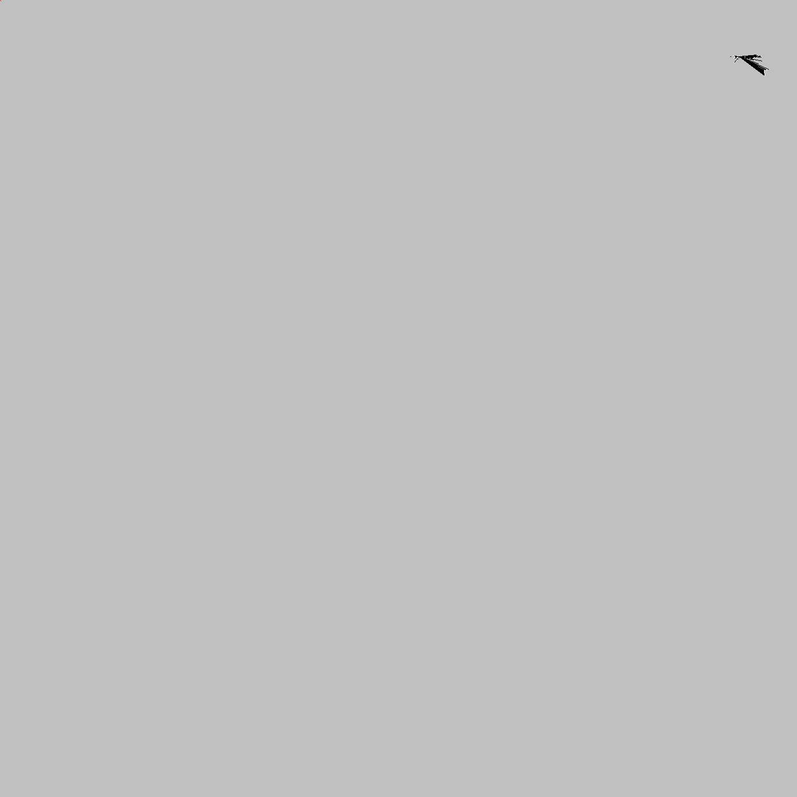
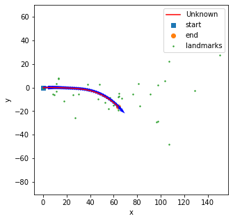
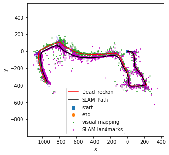

# My-Robotics-Projects
These are a variety of robotics projects I have worked on in my courses. Since a number of these projects are still used in the courses I am unable to post the code publically but feel free to contact me directly for code. 

## Gaussian Naive Bayes Model for Color
Read more [here](./Naive_Bayes_Object_Detection.pdf)

This project involved locating recycyling bins within images. By utilizing the Gaussian Naive Bayes Model I was able to extract pixel values from the training set and find bin locations in the test set.

## Particle Filter SLAM
Read more [here](./Particle_Filter_SLAM.pdf)

This project involved implementing particle filter slam and texture mapping for a dataset which contained IMU, Encoder, Lidar, and Stereo Camera Images. Since particle filter slam is so computationally expensive it taught me alot about vectorization and optimization with numpy.

Path of Car

Slam Output

## Visual Inertial SLAM
Read more [here](./Visual_Inertial_SLAM.pdf)

This project involved implementing visual inertial SLAM utilizing an Extended Kalman Filter. The output of the slam can be seen below:

## Dynamic Programming Path Planning
This project involved using dynamic programming to have an agent reach a key then unlock a door and reach the exit

Read more [here](./Dynamic_programming.pdf)

## Motion Planning
This project involved using A* and RRT algorithms to find the shortes path through complex 3D enviroments

Read more [here](./Motion_Planning.pdf)

## Optimal Control

This project involved trying to make an agent follow a pathhh using Receding-horizon certainty equivalent control and Generalized Policy Iteration 

Read more [here](./Optimal_control.pdf)
